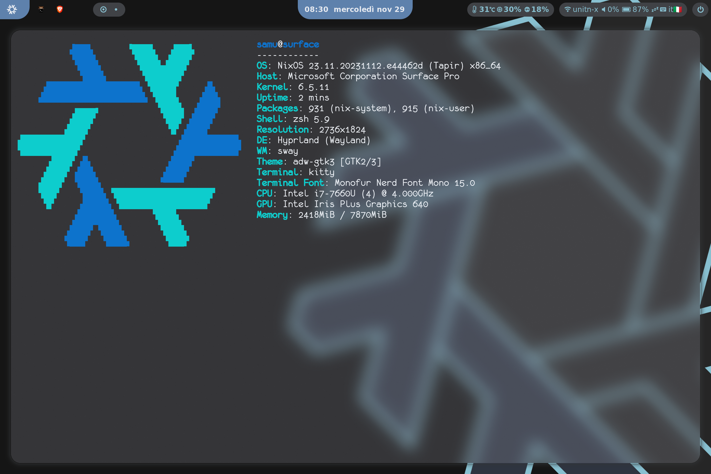

# My nixos Flake :snowflake:

<!-- 
to count the lines that I've written
find ./ "" -type f 2>/dev/null -not -path '*/.*' | grep -v -E ".git|.png|.age|.jpg|.pem|.lock|.zsh|.py|.conf" | xargs cat | wc -l 

https://github.com/MayNiklas/eduroam-flake
-->



This is more than my config, it's a flake. There are a couple packages, flake templates and overlays too.

I currently manage it in order to be easy to pick and use for everybody. The main user name is defined in an option
and secrets are optionals. In [the this default config](host/genericLinux/default.nix) you can 
find a sample config that shoud easy to tweak. 
If you want to to a test just use the install wizard (desciption below)


### Packages:
- xdg-desktop-portal-termfilechooser (use ranger instead of gui file manager)
- monofurx (patched version of the original monofur)
- libcamera-surface (see the file for credits, update to version 0.1.0)


### Setup

#### Nixos setup

I've made a wizard for setupping this config on a new nixos machine.
Just run `nix run github:SamueleFacenda/nixos-config` and follow the instructions.

#### Flake setup

If you want to use that packages in your config:
```
inputs.nixos-samu.url = "github:SamueleFacenda/nixos-config";
inputs.nixos-samu.inputs.nixpkgs.follows = "nixpkgs";

# configuration.nix

{inputs, pkgs, ...}: {
  xdg.portal.extraPortals = with pkgs; [
    inputs.nixos-samu.packages.${pkgs.system}.xdg-desktop-portal-termfilechooser
  ];
  
  font.packages = [
    inputs.nixos-samu.packages.${pkgs.system}.monofurx
  ];
}

```

#### How to configure after install

If you plan to use this on you machine it should be easy to do.
The process is described above, and you also should:
- create a new [host](host/genericLinux/default.nix)
- edit [the git config](home/programs/git)
- regenerate the [secrets](secrets/README.md)
- change the [system language](modules/system.nix)
- change the [wifi settings](modules/network.nix)
- edit the [wakatime settings](home/programs/wakatime.nix)
- edit the [spotifyd settings](home/programs/spotify.nix)
- edit the monitos in [hyprpaper](home/hyprland/hyprpaper.nix),
[kanshi](home/hyprland/kanshi.nix) and [hyprland conf](home/hyprland/settings.nix)
- edit the [waybar config](home/hyprland/waybar/settings.nix): the outputs,
 the keyboards and the temperature thermal zone.


TODOS:
- [x] zsh
- [x] powerlevel10k
- [ ] neovim + copilot
- [x] secure boot
- [x] surface kernel
- [x] IPTS (surface pen)
- [x] fonts
- [x] cache cleanup
- [x] rice (for me this is enough)
- [x] wallaper(s)
- [x] wakatime
- [x] cli trash bin with clean up
- [x] spotify with spicetify
- [x] ranger with kitty image preview
- [x] hyprland
- [x] agenix
- [x] dev and pwn shells
- [x] kitty
- [x] remote build with nixbuild.net
- [ ] home server containers
- [x] waybar
- [x] xdg-desktop-portal-shana
- [x] known networks
- [x] hyprland gnome indipendence
- [x] power profiles daemon
- [x] wpa supplicant config
- [x] nordic like theme (blue dark)
- [x] make suspend, screen off and sleep work
- [x] stylix
- [ ] phone integration (kde connect/gsconnects)
- [ ] waydroid
- [ ] customize kernel
- [x] kanshi dynamic monitor config (crash on change, hyprland problem)
- [x] nixd language server
- [x] swayosd (on screen display)
- [ ] flameshot
- [ ] iio-hyprland
- [ ] nwg-drawer
- [ ] nwg-dock-hyprland
- [x] hyprfocus
- [x] spotifyd, spotify-player
- [x] flake templates
- [ ] waybar mpris, taskbar, drawers for brightness
- [ ] waycorner
- [x] adjust nixpkgs wayland overlay
- [x] termfilechooser portal
- [x] spotify-player
- [ ] discocss (discord)
- [ ] nix index database
- [ ] tinyproxy wakapi
- [x] flake installer wizard with nix run
- [x] on screen keyboard for tablet mode
- [x] networkmanager config
- [x] image builder
- [ ] syncthing
- [x] nwg bar
- [x] touchpad gestures (fusuma)
- [x] hyprland workspacer (good workspaces on multi-monitor)
- [ ] swaync
- [x] anti oled burn-in
- [ ] howdy
- [ ] hyprswitch
- [ ] resolve power plugged problem
- [x] hyprcursor Adwaita
- [ ] hyprexpo
- [x] luks2, tmp2 unlock
- [ ] nh
- [ ] cuda

### Overlays (custom packages and other):
- micro-wakatime (faster loading)
- nerdfonts (use monofur with bullet point character from blexmono)
- rpl (update version)
- monofurx (new pkg)
- libcamera-surface (new pkg)
- xdg-desktop-portal-termfilechooser (new pkg)
- eza (add some icons mapping)
- nwg-bar (better icon support with gtk themes)
